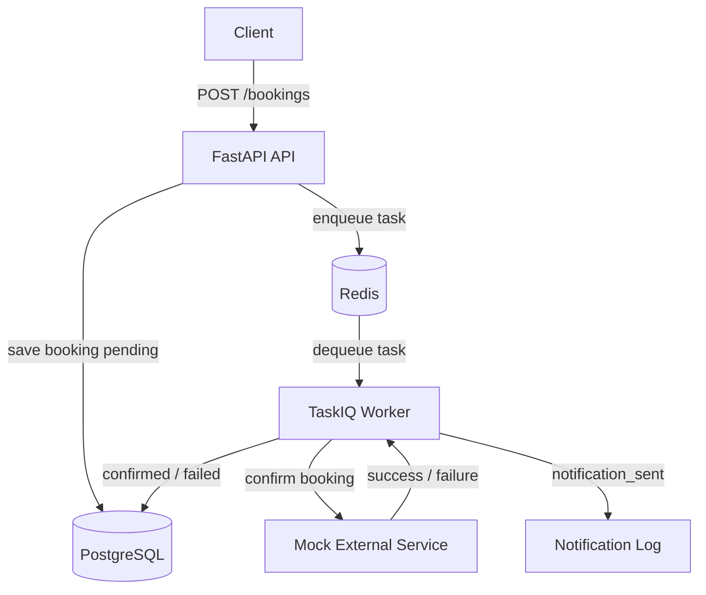
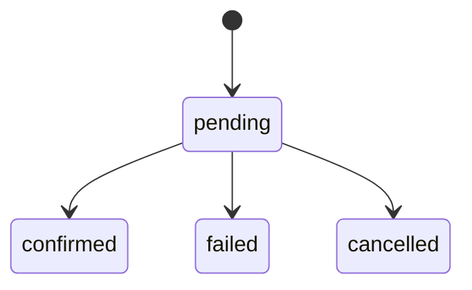

# Booking Service

🇷🇺 [Русская версия](README.ru.md)

Small async backend service built as a professional Python Backend technical assignment.
It lets clients create, read, list, and cancel appointment bookings. When a booking is created,
the API stores it as `pending` and enqueues a TaskIQ background task that simulates an external
integration. If the integration succeeds, the booking becomes `confirmed` and a mock notification
is written to structured logs. If it fails, the booking becomes `failed`.

## Quick Start

```bash
docker compose up --build
```

- API: `http://localhost:8000`
- Interactive API docs: `http://localhost:8000/docs`

```bash
python3.12 -m venv .venv
. .venv/bin/activate
pip install -r requirements.txt
pytest
```

## Architecture Overview



## Booking Lifecycle



## Assignment Coverage

- ✅ **REST API:** implements `POST /bookings`, `GET /bookings/{id}`, `GET /bookings` with status
  filtering and pagination, and `DELETE /bookings/{id}` for pending-only cancellation.
- ✅ **Background processing:** enqueues a task immediately after booking creation; the worker
  simulates an external service, applies an approximate 15% business failure probability, updates
  status to `confirmed` or `failed`, and logs a mock notification on success.
- ✅ **Idempotency:** worker updates are protected by an atomic conditional `UPDATE`, so repeated or
  concurrent task execution does not duplicate side effects or corrupt status.
- ✅ **Storage and infrastructure:** PostgreSQL, Redis, Alembic migrations, Docker Compose, and
  `.env.example` are included.
- ✅ **Tests:** pytest covers API behavior and worker logic, and runs from the repository root
  without Docker.
- ✅ **Bonus items:** exponential backoff retry, structured JSON logging, distributed rate limiting,
  async FastAPI + TaskIQ instead of Celery, and a Makefile with `dev`, `test`, `lint`, `migrate`,
  and `revision`.

## Technical Highlights

- Atomic worker idempotency with a conditional `UPDATE`.
- Async-native TaskIQ worker using the same `AsyncSession` pattern as the API.
- Redis-backed distributed rate limiting for `POST /bookings`.
- Tests run without Docker by using SQLite async and `fakeredis`.
- Structured logs capture mock external side effects such as `notification_sent`.

## General Architecture

- **FastAPI** exposes the REST API and validates requests with Pydantic v2.
- **SQLAlchemy 2.0 async** handles database access for both the API and the worker without
  blocking the event loop.
- **PostgreSQL** is the runtime database.
- **Alembic** versions the schema and manages migrations for the `bookings` table.
- **Redis** is used as the TaskIQ broker and as the distributed rate-limit backend.
- **TaskIQ** runs async-native background processing for booking confirmation.
- **pytest + SQLite async** allow tests to run without Docker, PostgreSQL, or a real Redis.
- **Docker Compose** starts the API, worker, PostgreSQL, and Redis with one command.

## Why These Decisions

**FastAPI** is a good fit for a compact REST service: clear validation, automatic OpenAPI,
native async support, and low maintenance overhead.

**TaskIQ + Redis** was chosen intentionally because the assignment lists Celery in the base
requirements but explicitly allows async FastAPI + TaskIQ instead of Celery as a bonus alternative.
It decouples the HTTP request from external work. The API responds quickly while confirmation is
delegated to the worker. TaskIQ lets the worker stay async-native with the same `AsyncSession`
pattern used by FastAPI, while Redis keeps the Compose setup simple.

**PostgreSQL + SQLAlchemy + Alembic** provide a production-friendly foundation: transactions,
strong data types, reproducible migrations, and an async ORM layer without raw SQL.

## Worker Idempotency

The `bookings.confirm_booking` task uses an atomic conditional `UPDATE`:

```sql
UPDATE bookings
SET status = :new_status, updated_at = now()
WHERE id = :booking_id AND status = 'pending'
RETURNING id
```

Only the execution that updates one row confirms or fails the booking and emits result logs.
If another execution has already changed the status, the task exits without sending another
notification or overwriting state. Before simulating the external integration, the worker reads
the current status to avoid unnecessary work when the booking is no longer `pending`.

The worker uses the same async engine as FastAPI. The dedicated synchronous engine that existed
for the Celery prefork model is no longer needed.

## Retry with Backoff

The TaskIQ task implements retry manually inside the coroutine: up to 3 attempts, exponential
backoff, and a small jitter before retrying. Expected failures from the simulated integration do
not raise exceptions; they update the booking to `failed`. Retry is reserved for unexpected
infrastructure or execution errors.

Implementation note: TaskIQ has retry middleware, but this project uses manual retry to keep the
local backoff explicit and avoid delayed scheduling/requeue machinery for this small scope.

## Logging

The service uses structured JSON logging with `structlog`. The mock notification is emitted as:

```json
{
  "event": "notification_sent",
  "booking_id": "...",
  "service_type": "...",
  "status": "confirmed"
}
```

## Run with Docker

```bash
docker compose up --build
```

For environments that still use the standalone Compose binary, the equivalent command is:

```bash
docker-compose up --build
```

The API is available at `http://localhost:8000`. Compose waits for PostgreSQL and Redis
healthchecks before starting the API and worker. The API runs `alembic upgrade head` on startup.

`docker-compose.yml` uses `.env.example` by default so the stack works out of the box. For local
customization outside Docker, copy it to `.env` and override values as needed.

## Migrations

```bash
make migrate
```

Create a new revision:

```bash
make revision message="add new field"
```

## Tests

Tests run without Docker:

```bash
python3.12 -m venv .venv
. .venv/bin/activate
pip install -r requirements.txt
```

```bash
pytest
```

Run linting:

```bash
ruff check app tests
```

Tests use SQLite async for the API and worker, and `fakeredis` for rate limiting. TaskIQ task
enqueueing is mocked so tests do not require a real Redis broker.

## Makefile

```bash
make dev
make test
make lint
make migrate
make revision message="..."
```

## Endpoints

### Create Booking

```bash
curl -X POST http://localhost:8000/bookings \
  -H "Content-Type: application/json" \
  -d '{
    "name": "Ada Lovelace",
    "datetime": "2026-06-20T10:00:00+00:00",
    "service_type": "consultation"
  }'
```

Response: `201 Created`, booking with `status=pending`.

### Get Booking

```bash
curl http://localhost:8000/bookings/{booking_id}
```

Returns `404` if the booking does not exist.

### List Bookings

```bash
curl "http://localhost:8000/bookings?limit=20&offset=0"
```

Filter by status:

```bash
curl "http://localhost:8000/bookings?status=confirmed&limit=10&offset=0"
```

### Cancel Booking

```bash
curl -X DELETE http://localhost:8000/bookings/{booking_id}
```

Only `pending` bookings can be cancelled. For `confirmed` or `failed` bookings, the API returns
`400`. There is no physical delete; the status changes to `cancelled`.

## States

- `pending`
- `confirmed`
- `failed`
- `cancelled`

## Rate Limiting

`POST /bookings` includes distributed per-IP rate limiting using Redis with a fixed
`INCR + EXPIRE` window. This works correctly with multiple Uvicorn replicas because the counter
does not live in local process memory.

Trade-off: a fixed window was chosen for operational simplicity. A sliding window based on sorted
sets would be more precise, but also more expensive for this scope.

## Changes from the Previous Version

- Worker idempotency is guaranteed with an atomic conditional `UPDATE`.
- Celery was replaced with async-native TaskIQ, allowing the worker to use `AsyncSession`
  consistently with the API.
- Rate limiting moved from local memory to distributed Redis.
- Booking validation rejects past datetimes.
- A composite `(status, created_at DESC)` index supports paginated status listings.
- The initial migration uses modern Python typing.
- README documentation reflects the current limitations and technical decisions.

## Known Limitations

- The external integration is simulated with a configurable failure probability.
- Worker idempotency is guaranteed with an atomic conditional `UPDATE`, including concurrent
  execution.
- The worker uses `AsyncSession` directly thanks to TaskIQ; there is no separate synchronous
  engine for tasks.
- There is no soft-delete or historical audit of status transitions. The final state is stored,
  but invalid transition attempts are not tracked with actor/time metadata.
- There is no authentication or authorization because it is outside the scope of this assignment.
- Notifications are not stored in a table; the mock notification is written to structured logs.
