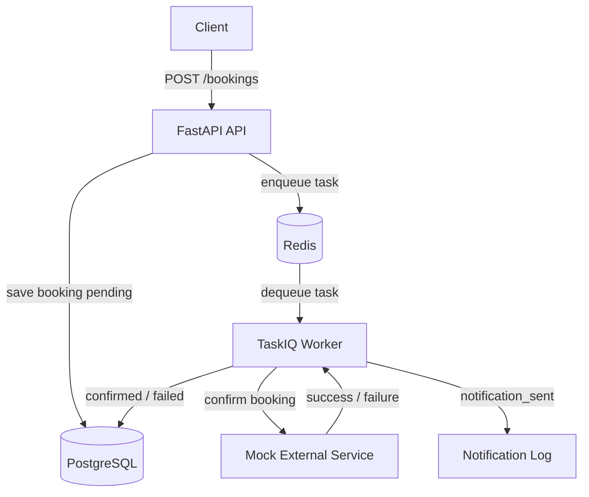
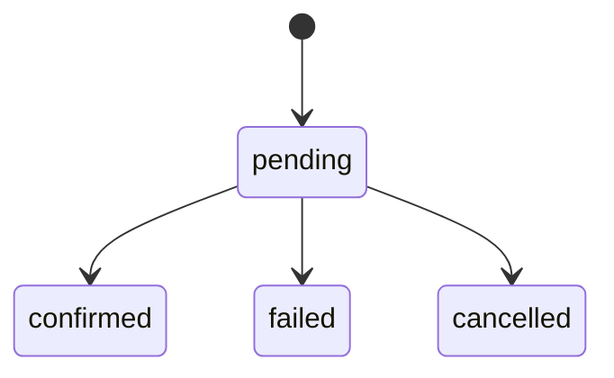

# Booking Service

🇺🇸 [English version](README.md)

Небольшой асинхронный backend-сервис, оформленный как профессиональное тестовое задание для
Python Backend. Сервис позволяет создавать, получать, просматривать списком и отменять записи
на услуги. При создании записи API сохраняет ее со статусом `pending` и ставит в очередь TaskIQ
фоновую задачу, которая имитирует интеграцию с внешним сервисом. Если интеграция успешна, запись
переходит в `confirmed`, а mock-уведомление пишется в структурированные логи. Если интеграция
завершается неуспешно, запись переходит в `failed`.

## Быстрый старт

```bash
docker compose up --build
```

- API: `http://localhost:8000`
- Интерактивная документация API: `http://localhost:8000/docs`

```bash
python3.12 -m venv .venv
. .venv/bin/activate
pip install -r requirements.txt
pytest
```

## Обзор архитектуры



## Жизненный цикл брони



## Соответствие заданию

- ✅ **REST API:** реализованы `POST /bookings`, `GET /bookings/{id}`, `GET /bookings` с фильтром
  по статусу и пагинацией, а также `DELETE /bookings/{id}` для отмены только `pending`-записей.
- ✅ **Фоновая обработка:** задача ставится в очередь сразу после создания записи; worker имитирует
  внешний сервис, применяет бизнес-ошибку с вероятностью около 15%, переводит запись в
  `confirmed` или `failed` и логирует mock-уведомление при успехе.
- ✅ **Идемпотентность:** обновления worker защищены атомарным условным `UPDATE`, поэтому повторный
  или конкурентный запуск задачи не дублирует побочные эффекты и не ломает статус.
- ✅ **Хранилище и инфраструктура:** в проекте есть PostgreSQL, Redis, Alembic-миграции,
  Docker Compose и `.env.example`.
- ✅ **Тесты:** pytest покрывает поведение API и логику worker; тесты запускаются из корня
  репозитория без Docker.
- ✅ **Плюсы:** retry с экспоненциальным backoff, structured JSON logging, распределенный rate
  limiting, async FastAPI + TaskIQ вместо Celery и Makefile с командами `dev`, `test`, `lint`,
  `migrate`, `revision`.

## Технические акценты

- Идемпотентность worker обеспечена атомарным условным `UPDATE`.
- Async-native worker на TaskIQ использует тот же паттерн `AsyncSession`, что и API.
- Распределенный rate limiting для `POST /bookings` работает через Redis.
- Тесты запускаются без Docker за счет SQLite async и `fakeredis`.
- Структурированные логи фиксируют mock-побочные эффекты внешней интеграции, например
  `notification_sent`.

## Общая архитектура

- **FastAPI** предоставляет REST API и валидирует запросы через Pydantic v2.
- **SQLAlchemy 2.0 async** отвечает за доступ к базе данных в API и worker без блокировки event
  loop.
- **PostgreSQL** используется как runtime-база данных.
- **Alembic** версионирует схему и управляет миграциями таблицы `bookings`.
- **Redis** используется как broker для TaskIQ и как распределенный backend для rate limiting.
- **TaskIQ** выполняет async-native фоновую обработку подтверждения записей.
- **pytest + SQLite async** позволяют запускать тесты без Docker, PostgreSQL и реального Redis.
- **Docker Compose** одной командой поднимает API, worker, PostgreSQL и Redis.

## Почему выбраны эти решения

**FastAPI** хорошо подходит для компактного REST-сервиса: понятная валидация, автоматический
OpenAPI, нативная поддержка async и низкая стоимость сопровождения.

**TaskIQ + Redis** выбран осознанно: в базовых требованиях указан Celery, но в разделе bonus явно
разрешена альтернатива — async FastAPI + TaskIQ вместо Celery. Такой подход отделяет HTTP-запрос
от работы с внешней системой. API быстро отвечает клиенту, а подтверждение выполняется в worker.
TaskIQ позволяет оставить worker async-native и использовать тот же паттерн `AsyncSession`, что и
FastAPI, а Redis делает Compose-конфигурацию простой.

**PostgreSQL + SQLAlchemy + Alembic** дают основу, близкую к production: транзакции, строгие типы,
воспроизводимые миграции и async ORM-слой без raw SQL.

## Идемпотентность worker

Задача `bookings.confirm_booking` использует атомарный условный `UPDATE`:

```sql
UPDATE bookings
SET status = :new_status, updated_at = now()
WHERE id = :booking_id AND status = 'pending'
RETURNING id
```

Только тот запуск, который реально обновил одну строку, подтверждает или отклоняет запись и
пишет итоговые логи. Если другой запуск уже изменил статус, задача завершается без повторной
отправки уведомления и без перезаписи состояния. Перед имитацией внешней интеграции worker читает
текущий статус, чтобы не выполнять лишнюю работу, если запись уже не находится в `pending`.

Worker использует тот же async engine, что и FastAPI. Отдельный синхронный engine, который был
нужен для prefork-модели Celery, больше не требуется.

## Retry с backoff

TaskIQ-задача реализует retry вручную внутри coroutine: максимум 3 попытки, экспоненциальный
backoff и небольшой jitter перед повтором. Ожидаемые ошибки симулированной интеграции не
выбрасывают исключение; они переводят запись в `failed`. Retry используется только для
неожиданных инфраструктурных ошибок или ошибок выполнения.

Замечание по реализации: в TaskIQ есть retry middleware, но в этом проекте выбран ручной retry,
чтобы backoff был локальным и явным, без механики отложенного scheduling/requeue для такого
небольшого scope.

## Logging

Сервис использует структурированные JSON-логи через `structlog`. Mock-уведомление пишется так:

```json
{
  "event": "notification_sent",
  "booking_id": "...",
  "service_type": "...",
  "status": "confirmed"
}
```

## Запуск через Docker

```bash
docker compose up --build
```

Если в окружении используется отдельный бинарник Compose, эквивалентная команда:

```bash
docker-compose up --build
```

API доступен по адресу `http://localhost:8000`. Compose ждет healthcheck PostgreSQL и Redis перед
запуском API и worker. При старте API выполняет `alembic upgrade head`.

`docker-compose.yml` по умолчанию использует `.env.example`, поэтому стек запускается сразу.
Для локальной настройки вне Docker можно скопировать файл в `.env` и переопределить нужные
значения.

## Миграции

```bash
make migrate
```

Создать новую ревизию:

```bash
make revision message="add new field"
```

## Тесты

Тесты запускаются без Docker:

```bash
python3.12 -m venv .venv
. .venv/bin/activate
pip install -r requirements.txt
```

```bash
pytest
```

Запуск линтера:

```bash
ruff check app tests
```

В тестах используется SQLite async для API и worker, а `fakeredis` — для rate limiting.
Постановка TaskIQ-задачи в очередь мокается, поэтому реальный Redis broker для тестов не нужен.

## Makefile

```bash
make dev
make test
make lint
make migrate
make revision message="..."
```

## Endpoints

### Создать запись

```bash
curl -X POST http://localhost:8000/bookings \
  -H "Content-Type: application/json" \
  -d '{
    "name": "Ada Lovelace",
    "datetime": "2026-06-20T10:00:00+00:00",
    "service_type": "consultation"
  }'
```

Ответ: `201 Created`, запись со статусом `status=pending`.

### Получить запись

```bash
curl http://localhost:8000/bookings/{booking_id}
```

Если запись не существует, возвращается `404`.

### Получить список записей

```bash
curl "http://localhost:8000/bookings?limit=20&offset=0"
```

Фильтрация по статусу:

```bash
curl "http://localhost:8000/bookings?status=confirmed&limit=10&offset=0"
```

### Отменить запись

```bash
curl -X DELETE http://localhost:8000/bookings/{booking_id}
```

Отменить можно только запись в статусе `pending`. Для записей в `confirmed` или `failed` API
возвращает `400`. Физического удаления нет: статус меняется на `cancelled`.

## Статусы

- `pending`
- `confirmed`
- `failed`
- `cancelled`

## Rate limiting

`POST /bookings` использует распределенный rate limiting по IP через Redis с фиксированным окном
`INCR + EXPIRE`. Это корректно работает с несколькими репликами Uvicorn, потому что счетчик не
живет в памяти отдельного процесса.

Trade-off: фиксированное окно выбрано ради операционной простоты. Sliding window на sorted sets
был бы точнее, но дороже для текущего scope.

## Изменения относительно предыдущей версии

- Идемпотентность worker гарантируется атомарным условным `UPDATE`.
- Celery заменен на async-native TaskIQ, поэтому worker использует `AsyncSession` единообразно
  с API.
- Rate limiting перенесен из локальной памяти в распределенный Redis.
- Валидация записей отклоняет даты в прошлом.
- Составной индекс `(status, created_at DESC)` ускоряет пагинированные списки по статусу.
- Начальная миграция использует современный Python typing.
- README отражает текущие ограничения и технические решения.

## Известные ограничения

- Внешняя интеграция симулируется с настраиваемой вероятностью отказа.
- Идемпотентность worker гарантируется атомарным условным `UPDATE`, включая конкурентное
  выполнение.
- Благодаря TaskIQ worker напрямую использует `AsyncSession`; отдельного синхронного engine для
  фоновых задач нет.
- Нет soft-delete и исторического аудита переходов статуса. Хранится финальное состояние, но
  не фиксируется, кто и когда пытался выполнить невалидный переход.
- Аутентификация и авторизация отсутствуют, потому что они вне scope этого задания.
- Уведомления не сохраняются в отдельную таблицу; mock-уведомление пишется в структурированные
  логи.
